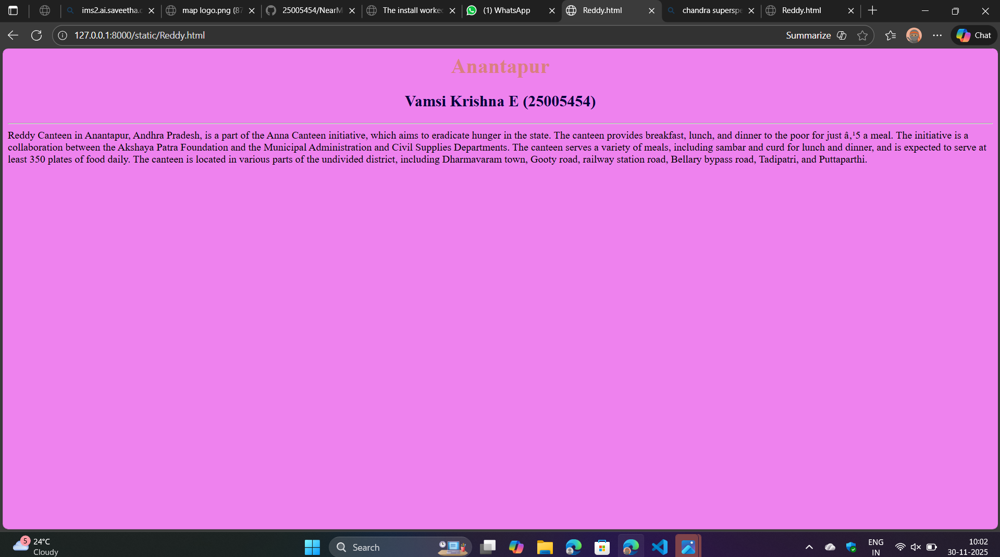
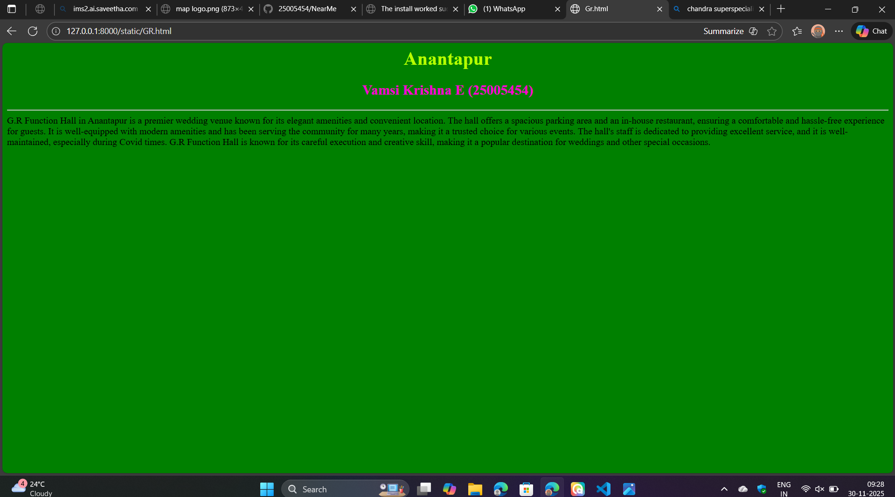
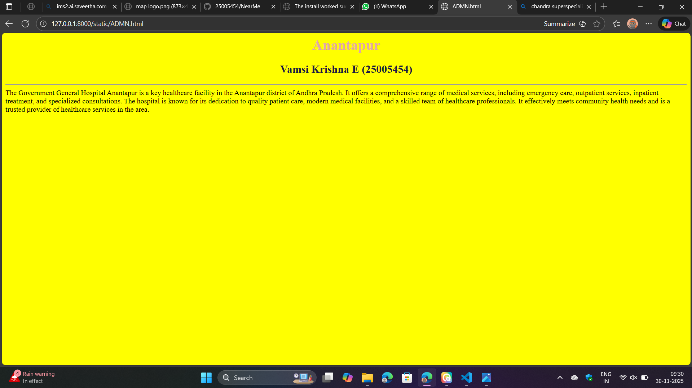
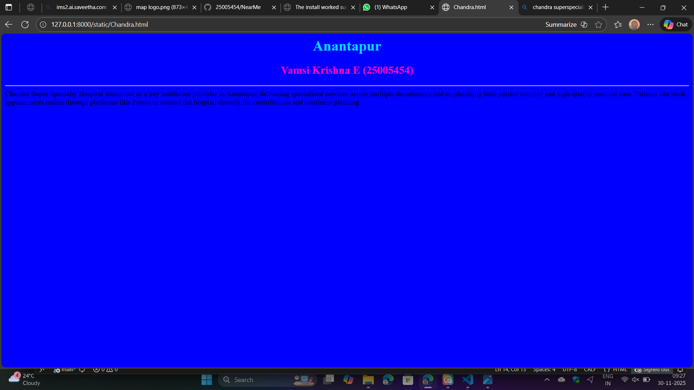
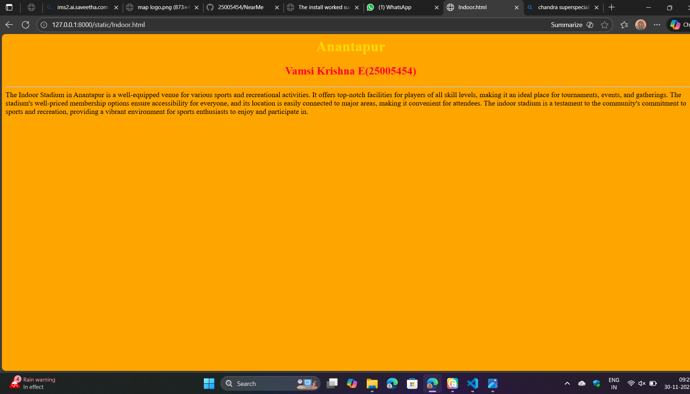

# Ex03 Places Around Me
## Date: 30.11.2025

## AIM
To develop a website to display details about the places around my house.

## DESIGN STEPS

### STEP 1
Create a Django admin interface.

### STEP 2
Download your city map from Google as an image.

### STEP 3
Insert the image using `````` tag and link it to the map.

### STEP 4
Using ```<map>``` tag name the map.

### STEP 5
Create clickable regions in the image using ```<area>``` tag.

### STEP 6
Write HTML programs for all the regions identified.

### STEP 7
Execute the programs and publish them.

## CODE
'''
map.html

<html>
<head>
<title>mapapp</title>
</head>
<body>
<h1 align="center">
<font color="red"><b>Anantapur</b></font>    
</h1>
<h3 align="center">
<font color="blue"><b>Vamsi Krishna E (25005454)</b></font>   
</h3>
<cenetr>


<map name="mapapp">
    <area target="" alt="Reddy's canteen" title="Reddy's canteen" href="Reddy.html" coords="221,113,367,165" shape="rect">
    <area target="" alt="G.R Funtion Hall" title="G.R Funtion Hall" href="GR.html" coords="387,61,46" shape="circle">
    <area target="" alt="ADMN govrenment general hospital" title="ADMN govrenment general hospital" href="ADMN.html" coords="249,277,431,325" shape="rect">
    <area target="" alt="Chandra super specialty hospital" title="Chandra super specialty hospital" href="Chandra.html" coords="574,5,485,27,481,86,665,89,664,32" shape="poly">
    <area target="" alt="Indoor stadium" title="Indoor stadium" href="Indoor.html" coords="513,360,37" shape="circle">
</map>   
</cenetr>    
</body>    
</html>

Reddy.html

<html>

    <head>

        <title>Reddy.html</title>

        <body bgcolor="violet">

            <h1 align="center" style="color:rgb(218, 127, 127);">Anantapur</h1>

            <h2 align="center" style="color:rgb(3, 3, 57);">Vamsi Krishna E (25005454)</h2>

            <hr>
            Reddy Canteen in Anantapur, Andhra Pradesh, is a part of the Anna Canteen initiative, which aims to eradicate hunger in the state. The canteen provides breakfast, lunch, and dinner to the poor for just ₹5 a meal. The initiative is a collaboration between the Akshaya Patra Foundation and the Municipal Administration and Civil Supplies Departments. The canteen serves a variety of meals, including sambar and curd for lunch and dinner, and is expected to serve at least 350 plates of food daily. The canteen is located in various parts of the undivided district, including Dharmavaram town, Gooty road, railway station road, Bellary bypass road, Tadipatri, and Puttaparthi.
        </body>

    </head>

</html>
GR.html

<html>

    <head>

        <title>Gr.html</title>

        <body bgcolor="green">

            <h1 align="center" style="color:rgb(183, 255, 0);">Anantapur</h1>

            <h2 align="center" style="color:rgb(255, 0, 212);">Vamsi Krishna E (25005454)</h2>

            <hr>
            G.R Function Hall in Anantapur is a premier wedding venue known for its elegant amenities and convenient location. The hall offers a spacious parking area and an in-house restaurant, ensuring a comfortable and hassle-free experience for guests. It is well-equipped with modern amenities and has been serving the community for many years, making it a trusted choice for various events. The hall's staff is dedicated to providing excellent service, and it is well-maintained, especially during Covid times. G.R Function Hall is known for its careful execution and creative skill, making it a popular destination for weddings and other special occasions.

        </body>

    </head>

</html>

ADMN.html

<html>

    <head>

        <title>ADMN.html</title>

        <body bgcolor="yellow">

            <h1 align="center" style="color:rgb(226, 168, 168);">Anantapur</h1>

            <h2 align="center" style="color:rgb(25, 25, 67);">Vamsi Krishna E (25005454)</h2>

            <hr>
            The Government General Hospital Anantapur is a key healthcare facility in the Anantapur district of Andhra Pradesh. It offers a comprehensive range of medical services, including emergency care, outpatient services, inpatient treatment, and specialized consultations. The hospital is known for its dedication to quality patient care, modern medical facilities, and a skilled team of healthcare professionals. It effectively meets community health needs and is a trusted provider of healthcare services in the area. 
        </body>

    </head>

</html>

Chandra.html

<html>

    <head>

        <title>Chandra.html</title>

        <body bgcolor="blue">

            <h1 align="center" style="color:rgb(0, 217, 255);">Anantapur</h1>

            <h2 align="center" style="color:rgb(255, 0, 195);">Vamsi Krishna E (25005454)</h2>

            <hr>
            Chandra Super Specialty Hospital stands out as a key healthcare provider in Anantapur, delivering specialized services across multiple departments and emphasizing both patient comfort and high-quality medical care. Patients can book appointments online through platforms like Practo or contact the hospital directly for consultations and treatment planning. 
        </body>

    </head>

</html>

Indoor.html

<html>

    <head>

        <title>Indoor.html</title>

        <body bgcolor="orange">

            <h1 align="center" style="color:rgb(255, 217, 0);">Anantapur</h1>

            <h2 align="center" style="color:rgb(255, 0, 43);">Vamsi Krishna E(25005454)</h2>

            <hr>
            The Indoor Stadium in Anantapur is a well-equipped venue for various sports and recreational activities. It offers top-notch facilities for players of all skill levels, making it an ideal place for tournaments, events, and gatherings. The stadium's well-priced membership options ensure accessibility for everyone, and its location is easily connected to major areas, making it convenient for attendees. The indoor stadium is a testament to the community's commitment to sports and recreation, providing a vibrant environment for sports enthusiasts to enjoy and participate in. 

        </body>

    </head>

</html>
'''
## OUTPUT








## RESULT
The program for implementing image maps using HTML is executed successfully.
